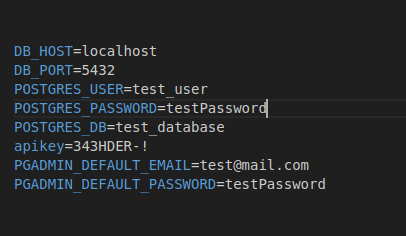

# Stocker

An application to get stock market insights for fundamental and technical analysis.

## Installation

- Clone the repository first into your selected location
- This project involves running a Postgres db instance inside a docker container to store data. So install docker using this link: : https://docs.docker.com/desktop/
- Create an account on docker with necessary credentials 
- For ease in dealing with Postgres, this project uses Pg-Admin, also running in the docker container
- Create a .env file in the root directory and add all the data as mentioned in the image below(the values can be altered, but structure should remain same):

- Finish the necessary setup for docker and run your container using the command: docker compose up
- Install the necessary dependencies using: go mod tidy command
